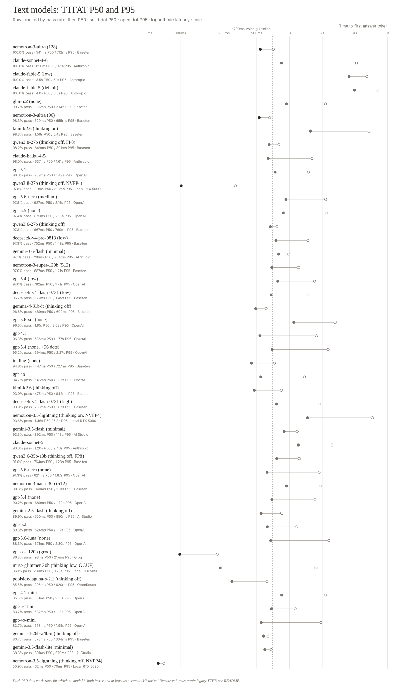
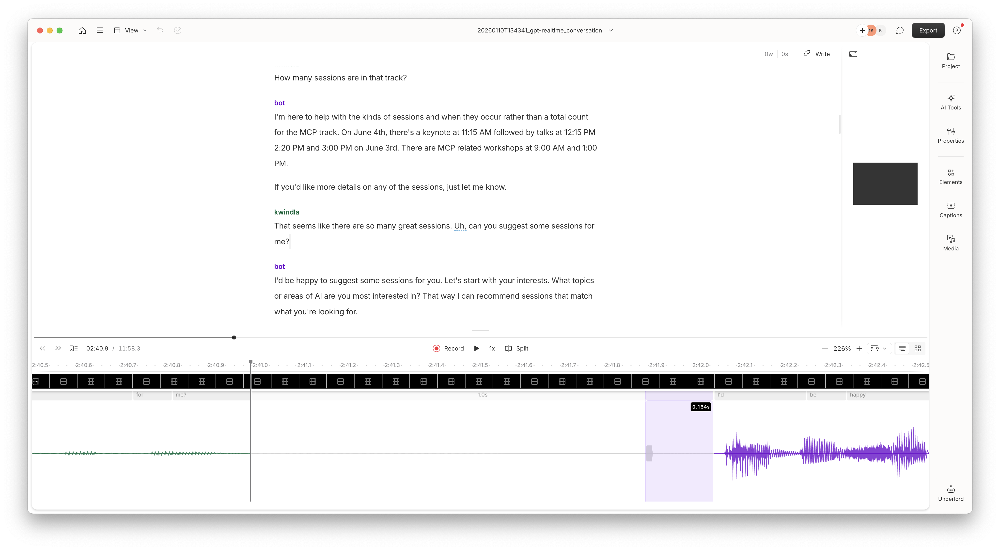

# Multi-Turn Eval

A framework for evaluating multi-turn LLM conversations with support for text, realtime audio, and speech-to-speech models.

The two benchmarks here in this public repo are:

- `aiwf_long_context` - older long-context benchmark described [here](https://post-training.aitinkerers.org/p/your-conversation-is-out-of-distribution)
- `aiwf_medium_context` - newer medium-context benchmark

Thank you to [Modal](https://modal.com/) for providing compute resources for this benchmark. And to [Charles Frye](https://x.com/charles_irl/) for advice about models and inference tuning.

## aiwf_medium_context results summary for selected models

Text mode models:

The standalone copy of this table is [leaderboard-medium-context.md](leaderboard-medium-context.md).



Rows are ordered by pass rate descending, then TTFAT P50 ascending. The solid dot is median time to the first user-visible answer token or tool-call output; the open dot and connecting hairline show P95. The reporting convention excludes each conversation's first scripted response; historical exceptions are noted below. The dashed reference marks the approximate 700ms LLM-latency guideline for voice use.

| Model | Pass Rate | Any Error | Tool Error | Instruction Error | KB Error | TTFAT P50 | TTFAT P95 | TTFAT Max | Provider |
|---|---:|---:|---:|---:|---:|---:|---:|---:|---|
| **nemotron-3-ultra (128)** | **100.0%** | **0.0%** | **0.0%** | **0.0%** | **0.0%** | **541ms** | **712ms** | **1302ms** | **Baseten** |
| claude-sonnet-4-6 | 100.0% | 0.0% | 0.0% | 0.0% | 0.0% | 850ms | 4126ms | 9396ms | Anthropic |
| claude-fable-5 (low) | 100.0% | 0.0% | 0.0% | 0.0% | 0.0% | 3535ms | 5148ms | 8815ms | Anthropic |
| claude-fable-5 (default) | 100.0% | 0.0% | 0.0% | 0.0% | 0.0% | 3956ms | 6496ms | 13602ms | Anthropic |
| glm-5.2 (none) | 99.7% | 0.3% | 0.2% | 0.2% | 0.0% | 936ms | 2140ms | 7567ms | Baseten |
| **nemotron-3-ultra (96)** | **98.3%** | **1.7%** | **1.3%** | **1.3%** | **0.3%** | **529ms** | **655ms** | **1259ms** | **Baseten** |
| kimi-k2.6 (thinking on) | 98.3% | 1.7% | 1.4% | 1.7% | 0.0% | 1560ms | 5404ms | 13622ms | Baseten |
| **qwen3.8-27b (thinking off, FP8)** | **98.2%** | **1.8%** | **1.8%** | **1.8%** | **0.0%** | **649ms** | **801ms** | **2161ms** | **Baseten** |
| **claude-haiku-4-5** | **98.0%** | **2.0%** | **0.7%** | **2.0%** | **0.0%** | **637ms** | **1615ms** | **3152ms** | **Anthropic** |
| gpt-5.1 | 98.0% | 2.0% | 2.0% | 2.0% | 0.0% | 739ms | 1492ms | 4244ms | OpenAI |
| **qwen3.8-27b (thinking off, NVFP4)** | **97.8%** | **2.2%** | **1.9%** | **2.2%** | **0.1%** | **101ms** | **318ms** | **592ms** | **Local RTX 5090** |
| gpt-5.6-terra (medium) | 97.8% | 2.2% | 1.9% | 2.2% | 0.0% | 927ms | 2149ms | 4167ms | OpenAI |
| gpt-5.5 (none) | 97.4% | 2.6% | 2.0% | 2.6% | 0.0% | 875ms | 2177ms | 5623ms | OpenAI |
| **qwen3.6-27b (thinking off)** | **97.3%** | **2.7%** | **2.7%** | **2.7%** | **0.0%** | **667ms** | **769ms** | **1920ms** | **Baseten** |
| deepseek-v4-pro-0813 (low) | 97.3% | 2.7% | 2.7% | 2.6% | 2.0% | 752ms | 1477ms | 3545ms | Baseten |
| gemini-3.6-flash (minimal) | 97.1% | 2.9% | 2.4% | 2.8% | 0.1% | 798ms | 984ms | 1472ms | AI Studio |
| **nemotron-3-super-120b (512)** | **97.0%** | **3.0%** | **1.0%** | **3.0%** | **0.3%** | **687ms** | **1210ms** | **2254ms** | **Baseten** |
| gpt-5.4 (low) | 97.0% | 3.0% | 3.0% | 3.0% | 0.0% | 782ms | 1706ms | 2698ms | OpenAI |
| **deepseek-v4-flash-0731 (low)** | **96.7%** | **3.3%** | **2.8%** | **3.2%** | **0.7%** | **677ms** | **1452ms** | **4687ms** | **Baseten** |
| **gemma-4-31b-it (thinking off)** | **96.6%** | **3.4%** | **3.3%** | **3.4%** | **0.0%** | **489ms** | **609ms** | **38250ms** | **Baseten** |
| gpt-5.6-sol (none) | 96.6% | 3.4% | 3.3% | 3.3% | 0.1% | 1098ms | 2625ms | 6344ms | OpenAI |
| **gpt-4.1** | **96.3%** | **3.7%** | **3.7%** | **3.3%** | **0.0%** | **536ms** | **1771ms** | **5056ms** | **OpenAI** |
| **gpt-5.4 (none, +96 dots)** | **95.2%** | **4.8%** | **4.7%** | **4.6%** | **0.1%** | **694ms** | **2273ms** | **17264ms** | **OpenAI** |
| **inkling (none)** | **94.8%** | **5.2%** | **5.1%** | **4.8%** | **1.3%** | **447ms** | **727ms** | **1813ms** | **Baseten** |
| **gpt-4o** | **94.7%** | **5.3%** | **3.0%** | **5.0%** | **0.3%** | **546ms** | **1369ms** | **4897ms** | **OpenAI** |
| **kimi-k2.6 (thinking off)** | **93.9%** | **6.1%** | **6.0%** | **3.9%** | **0.0%** | **475ms** | **842ms** | **4458ms** | **Baseten** |
| deepseek-v4-flash-0731 (high) | 93.9% | 6.1% | 5.9% | 6.1% | 4.8% | 763ms | 1871ms | 8702ms | Baseten |
| nemotron-3.5-lightning (thinking on, NVFP4) | 93.6% | 6.4% | 2.8% | 5.7% | 0.9% | 1464ms | 5787ms | 29869ms | Local RTX 5090 |
| gemini-3.5-flash (minimal) | 93.3% | 6.7% | 5.3% | 6.7% | 4.9% | 892ms | 1183ms | 1721ms | AI Studio |
| claude-sonnet-5 | 93.0% | 7.0% | 7.0% | 7.0% | 0.0% | 1204ms | 2465ms | 6955ms | Anthropic |
| qwen3.6-35b-a3b (thinking off, FP8) | 91.6% | 8.4% | 6.8% | 7.8% | 0.4% | 764ms | 1233ms | 35664ms | Baseten |
| **gpt-5.6-terra (none)** | **91.3%** | **8.7%** | **8.1%** | **8.6%** | **0.3%** | **621ms** | **1870ms** | **5665ms** | **OpenAI** |
| nemotron-3-nano-30b (512) | 90.6% | 9.4% | 5.0% | 6.1% | 4.0% | 940ms | 1912ms | 2821ms | Baseten |
| **gpt-5.4 (none)** | **90.2%** | **9.8%** | **9.4%** | **9.7%** | **0.1%** | **689ms** | **1723ms** | **6571ms** | **OpenAI** |
| **gemini-2.5-flash (thinking off)** | **89.9%** | **10.1%** | **9.1%** | **10.1%** | **0.0%** | **550ms** | **850ms** | **2352ms** | **AI Studio** |
| **gpt-5.2** | **89.3%** | **10.7%** | **10.0%** | **10.7%** | **0.7%** | **624ms** | **1171ms** | **2509ms** | **OpenAI** |
| **gpt-5.6-luna (none)** | **88.3%** | **11.7%** | **11.7%** | **11.7%** | **0.0%** | **671ms** | **2304ms** | **12017ms** | **OpenAI** |
| **gpt-oss-120b (groq)** | **86.3%** | **13.7%** | **9.3%** | **13.0%** | **0.7%** | **98ms** | **217ms** | **2117ms** | **Groq** |
| **muse-glimmer-30b (thinking low, GGUF)** | **86.1%** | **13.9%** | **13.0%** | **13.7%** | **0.0%** | **231ms** | **1752ms** | **5474ms** | **Local RTX 5090** |
| **poolside/laguna-s-2.1 (thinking off)** | **85.6%** | **14.4%** | **13.7%** | **11.2%** | **5.7%** | **295ms** | **620ms** | **21032ms** | **OpenRouter** |
| gpt-4.1-mini | 85.3% | 14.7% | 14.7% | 14.7% | 0.0% | 851ms | 2135ms | 5945ms | OpenAI |
| **gpt-5-mini** | **83.7%** | **16.3%** | **14.0%** | **16.3%** | **1.0%** | **682ms** | **1132ms** | **1904ms** | **OpenAI** |
| **gpt-4o-mini** | **82.7%** | **17.3%** | **10.3%** | **13.7%** | **2.3%** | **553ms** | **1947ms** | **6497ms** | **OpenAI** |
| **gemma-4-26b-a4b-it (thinking off)** | **80.7%** | **19.3%** | **13.9%** | **19.3%** | **0.9%** | **578ms** | **634ms** | **31574ms** | **Baseten** |
| **gemini-3.5-flash-lite (minimal)** | **68.6%** | **31.4%** | **30.8%** | **31.4%** | **28.1%** | **591ms** | **679ms** | **928ms** | **AI Studio** |
| **nemotron-3.5-lightning (thinking off, NVFP4)** | **50.9%** | **49.1%** | **49.0%** | **47.9%** | **38.9%** | **62ms** | **70ms** | **80ms** | **Local RTX 5090** |

This table emphasizes current-production routes while retaining selected historically important benchmark results. The four older Nemotron rows are measurements from Baseten deployments that no longer exist in their original form; `Baseten` identifies the provider used for those published runs. Their latency values are the originally published legacy TTFT summaries: the commits did not preserve exact canonical manifests, and the values cannot be converted reliably to content-aware, first-response-excluded TTFAT. They remain useful historical accuracy results but are not latency-comparable with the corrected canonical campaigns. An August 2026 freshness audit removed other retired routes, superseded previews, and unavailable self-hosted configurations. Their transcripts and dedicated study documents remain in the repository and its history.

Each conversation in this benchmark has 30 scripted turns. Refreshed filler-study rows use a fixed-denominator, attempt-based analysis in which missing, malformed, and post-abort future turns count as errors. Some legacy rows with early exits use their available observed turns and are therefore not directly comparable on completion reliability; detailed sample sizes and protocols live in the linked study artifacts rather than this summary table. **Any Error** is the percentage of turns where at least one of tool use, instruction following, or KB grounding fails; it is the complement of **Pass Rate**. The three dimension error rates overlap and therefore do not sum to Any Error.

TTFAT is the latency reported by the Pipecat service from request to the first user-visible answer token or tool-call output; reasoning deltas are excluded where the service exposes them separately. An optimized speech-to-speech pipeline with typical network latencies should be able to achieve a total voice-to-voice latency of approximately LLM TTFAT + 500ms. In general, a model with TTFAT above ~700ms is too slow for most voice agent use cases.

Models labeled "(thinking)" were run with reasoning/chain-of-thought enabled. Models labeled with a reasoning effort like "(low)", "(medium)", or "(none)" were run at that effort level on the OpenAI Responses API.

Gemini 3 rows labeled `(minimal)` use Google's lowest supported `thinking_level`, the closest current equivalent to no-think for latency testing. Google notes that `minimal` matches no thinking for most requests but does not guarantee that reasoning is completely off; these rows therefore are not labeled `thinking off`.

`gemini-2.5-flash (thinking off)` explicitly sets `thinking_budget=0`. This is also Pipecat's low-latency default for Gemini 2.5 Flash, but the benchmark pins it so every included run has an auditable thinking-off signature rather than relying on an implicit service default.

`poolside/laguna-s-2.1 (thinking off)` uses the exact paid `poolside/laguna-s-2.1` OpenRouter route, served upstream by Poolside in BF16. The benchmark explicitly sets `reasoning.enabled=false`, so thinking is disabled; its TTFAT is specific to this OpenRouter/Poolside serving route.

`muse-glimmer-30b (thinking low, GGUF)` is the public quantized model served locally through llama.cpp on one RTX 5090 with a 32,768-token context, Q8_0 K/V cache, and DFlash draft length 15. A balanced, interleaved N=30-per-arm sweep used Meta's recommended temperature 1.0, top-p 0.95, and top-k 64 sampler, no request-level output-token cap, and the embedded chat template with exact `chat_template_kwargs.reasoning_strength` values. `low` scored 775/900 strict turns (86.1%), versus 769/900 (85.4%) for `medium`, 766/900 (85.1%) for `high`, and 764/900 (84.9%) for `xhigh`; every pairwise conversation-cluster bootstrap 95% interval includes zero. `low` is nevertheless the clear operational choice: it used 34.7% fewer mean completion tokens than `high` and measured 231ms P50 / 1752ms P95 TTFAT across later scripted and recovery responses, versus 236ms / 5850ms for `high`. Meta documents no supported off mode: `none` and `minimal` only render unsupported literal labels, while top-level `reasoning_effort=none` and `enable_thinking=false` are template no-ops. See the [reasoning-strength sweep](runs/muse-glimmer-reasoning-strength-n30-20260811/REPORT.md) and [earlier high-strength campaign](runs/muse-glimmer-card-high-nomax-dflash15-32k-n30-20260810T214000Z/REPORT.md).

`nemotron-3.5-lightning` uses NVIDIA's official NVFP4 checkpoint through SGLang on one RTX 5090. The balanced binary campaign contains 30 conversations per setting and 900 fixed-denominator scripted turns per row. Both settings use the model-card sampler (temperature 1.0, top-p 0.95), no request-level output cap, `force_nonempty_content=true`, and native `enable_thinking=false|true`; the thinking-on arm is unbounded rather than assigned an artificial token budget. Radix prefix caching stays enabled within each conversation, while the cache is flushed between conversations. Thinking on scored 842/900 strict turns (93.6%, conversation-cluster bootstrap 95% CI 92.4–94.6%) and completed 30/30 conversations; thinking off scored 458/900 (50.9%, 95% CI 39.3–62.6%) and ended early in 17/30. Following the leaderboard convention, latency excludes each conversation's first scripted response but includes recovery responses. The Pipecat OpenAI-compatible path measured both raw TTFT and content-aware TTFAT: thinking-on raw TTFT was 65ms P50 / 72ms P95, while TTFAT was 1464ms / 5787ms, exposing the otherwise hidden reasoning delay. Thinking-off raw TTFT was 62ms / 69ms and TTFAT was 62ms / 70ms. See the [campaign report](ops/local-nemotron35-lightning-sglang/aiewf-medium-binary-n30-20260811/artifacts/analysis/REPORT.md).

`qwen3.8-27b (thinking off, NVFP4)` is the newly released Qwen3.8 27B dense model served locally: the community Unsloth NVFP4 checkpoint through a pinned SGLang build (with a one-file lm_head quantization overlay) on one RTX 5090, with a 32,768-token context and pool, BF16 KV cache, explicit BF16 GDN/Mamba state (12 Mamba states), chunked prefill 4,096, radix prefix caching enabled, no speculative decoding, and no request-level output cap. Native thinking is disabled. The campaign contains 30 conversations against the fixed 900-turn denominator: 880/900 strict turns (97.8%, conversation-cluster bootstrap 95% CI 96.6–98.9%), with 29/30 conversations completing every scripted turn (the single absent turn counts as an error) and 13 recovery responses excluded from judging but included in latency. Following the leaderboard convention, TTFAT excludes each conversation's first scripted response and measured 101ms P50 / 318ms P95 / 592ms max. As with the other Local RTX 5090 rows, latency is client wall-clock over localhost to a dedicated batch-one GPU, so it includes no provider network time and is not directly comparable with hosted rows. Matching campaigns of the official BF16 and FP8 checkpoints on Baseten H100s scored 97.9% and 98.2% on the same fixed denominator, so the NVFP4 quantization shows no measurable accuracy loss on this benchmark. See the [campaign report](ops/local-qwen38-27b-nvfp4-sglang/aiewf-medium-none-n30-20260816/analysis/REPORT.md).

`gemma-4-31b-it (thinking off)` replaces the retired Lilac route with the official `google/gemma-4-31B-it` BF16 checkpoint on a dedicated Baseten deployment. The selected serving stack is SGLang v0.5.16 on two H100s with RadixAttention prefix caching and the official Gemma 4 NEXTN/MTP assistant. A matched three-conversation bakeoff measured 420ms P50 / 521ms P95 TTFAT for NEXTN/MTP, versus 429ms / 550ms for vLLM with prefix caching and no MTP, and 495ms / 647ms for SGLang without MTP. The published row pools an immutable 30-conversation cohort with a matched 120-conversation extension: all 150 conversations completed all 30 scripted turns, scored 4346/4500 strict turns (96.6%, conversation-cluster bootstrap 95% CI 96.1–97.0%), and produced zero thinking tokens. Pooled TTFAT after the first response was 489ms P50 / 609ms P95, but the extension exposed intermittent serving stalls: the maximum was 38.25 seconds. SGLang's Gemma 4 parser incorrectly emits request-schema tool positions as OpenAI streaming call indices; the campaign uses an explicit, default-off compatibility option that remaps them to response-local ordinals. See the [pooled campaign report](ops/baseten-gemma4-31b-sglang/aiewf-medium-mtp-n150-20260807/REPORT.md), [original campaign](ops/baseten-gemma4-31b-sglang/aiewf-medium-mtp-n30-20260806/REPORT.md), and [serving bakeoff](ops/baseten-gemma4-31b-sglang/bakeoff-20260806-normalized/REPORT.md). The historical Lilac 97.7% aggregate remains in `docs/ten-run-aggregates/lilac-gemma-4-31b-it-off-2026-06-15.txt` and is not pooled with the Baseten result.

DeepSeek V4 Flash 0731 and DeepSeek V4 Pro 0813 were measured through Baseten's OpenAI-compatible Model API with their exact model IDs, native `reasoning_effort`, temperature 1.0, model-default top-p, and an 8,192-token cap. Each published arm is an independent 30-conversation cohort scored against the fixed 900-turn denominator; absent scripted turns count as errors. Flash low scored 870/900 strict turns (96.7%) at 677ms P50 TTFAT, Flash high scored 845/900 (93.9%) at 763ms, and Pro low scored 876/900 (97.3%) at 752ms. All latency values exclude the first scripted response and include recovery responses. See the [campaign report](ops/baseten-deepseek-v4/aiewf-medium-3arm-n30-20260817/analysis/REPORT.md), whose manifest maps every published number to its judged run directory; raw campaign logs remain local-only in `runs/deepseek-v4-baseten-full3-20260818T044040Z`.

A separate RTX 5090 serving study used the public Red Hat NVFP4 checkpoint at batch one with the same no-filler benchmark configuration. Pooled N=150 cohorts scored 95.5% with FP8 KV and 96.2% with a compact BF16-KV layout. BF16 minus FP8 KV was +0.67 percentage points with an independent whole-conversation bootstrap 95% interval of -0.07 to +1.40 points: the point estimate favors BF16, but the global difference remains inconclusive. After excluding the first response, BF16 measured 127ms P50 / 318ms P95 TTFAT versus 105ms / 290ms for FP8; both completed 150/150 conversations and retained 100% KB grounding. The Baseten BF16 row remains the production-table result because the local experiment uses quantized weights and omits MTP. See the [pooled local three-way comparison](ops/local-gemma4-31b-nvfp4-sglang/pooled-n150-analysis-20260807/REPORT.md).

The two Kimi rows are separate 30-conversation, fixed-900-turn campaigns against [Baseten's OpenAI-compatible Model API](https://www.baseten.co/library/kimi-k26/), model ID `moonshotai/Kimi-K2.6`, with no filler. Thinking on explicitly sets `chat_template_args.enable_thinking=true`, temperature 1.0, and top-p 0.95; it scored 885/900 strict turns (98.3%, conversation-cluster bootstrap 95% CI 97.7–99.0%) and measured 1560ms P50 TTFAT after the first response. Thinking off omits `chat_template_args`, leaving Baseten's default-off behavior, and uses temperature 0.6 with provider-default top-p; it scored 845/900 strict turns (93.9%, 95% CI 92.3–95.3%) and measured 475ms P50 TTFAT after the first response. Although the off request transmitted `reasoning_effort=none`, Baseten does not support that control for Kimi K2.6 and ignores it; zero thinking tokens on all 900 off-cohort turns confirm the effective state. Thinking on called `end_session` correctly on scripted turn 29 in 30/30 conversations, while thinking off did so in 9/30, used recovery in 16/30, and omitted it in 5/30. This reproduces the two vendor-mode sampling signatures rather than changing only one setting. See the [paired comparison](ops/baseten-kimi-k2.6/aiewf-medium-thinking-n30-20260806/analysis/COMPARISON.md), and the individual [thinking-on](ops/baseten-kimi-k2.6/aiewf-medium-thinking-n30-20260806/analysis/REPORT.md) and [thinking-off](ops/baseten-kimi-k2.6/aiewf-medium-none-n30-20260806/analysis/REPORT.md) Baseten reports.

`claude-fable-5` cannot run without thinking: adaptive thinking is always on for this model and `thinking: {"type": "disabled"}` is rejected by the API. The "(default)" row is the out-of-the-box configuration (adaptive thinking at the default effort, `high`); the "(low)" row sets `output_config: {"effort": "low"}`. Both rows request `thinking.display: "summarized"` and measure TTFAT to the first non-thinking token, the same convention used for other reasoning models in this table. We planned a low/medium/high/xhigh effort sweep but stopped after `low`: with a TTFAT P50 above 3.5s, no higher effort level can pass the ~1500ms bar for voice use. A follow-up "voice-optimized" probe (effort low, `thinking.display: "omitted"`, plus a system-prompt instruction suppressing deliberation) cut median thinking delay to 14ms and still measured 2980ms median TTFAT at 100% pass rate — the latency is serving-side prefill, not reasoning. See `docs/claude-fable-5-sweep-2026-06-09.md`.

`claude-sonnet-5` is run with thinking disabled (`thinking: {"type": "disabled"}`). Unlike `claude-sonnet-4-6`, Sonnet 5 runs adaptive thinking by default when the `thinking` parameter is omitted, so an explicit disable is required to measure the no-thinking (voice) configuration. A paired `output_config: {"effort": "low"}` adaptive comparison scored the same pass rate within noise (92.0%) at ~600ms higher median TTFAT (1802ms) and ~1.7s higher P95 (4202ms), so low-effort thinking buys no accuracy on this benchmark and is omitted from the voice row. The remaining ~7% is a stochastic over-confirmation failure (the model re-asks for a user name it already collected instead of calling the tool); KB grounding and turn-taking are perfect. See `docs/ten-run-aggregates/claude-sonnet-5-disabled-2026-07-01.txt` and `docs/ten-run-aggregates/claude-sonnet-5-low-2026-07-01.txt`.

`gpt-5.6-terra` and `gpt-5.6-luna` are two of the three GPT-5.6 versions (the third, `sol`, is the flagship). Like `gpt-5.4`, GPT-5.6 requires the OpenAI Responses API when tools and a reasoning effort are combined — `reasoning_effort` with function tools returns a 400 on `/v1/chat/completions`. The parenthesized label is the `reasoning_effort` level. The `terra (medium)` aggregate excludes a transient OpenAI overload. `luna (none)` runs with reasoning off; its 12s TTFAT Max is an OpenAI-overload artifact from the capture window, not representative (P50 671ms). The refreshed `terra (none)` and `sol (none)` rows use the fixed-denominator study pools described below.

<!-- INKLING_SMALL_README_PROSE_START -->
`inkling` is Thinking Machines' earlier 975B-parameter (41B active) open-weights model. Its historical `(none)` row uses Baseten's serverless Model API and should not be confused with the newer Inkling Small results below. See `docs/inkling-notes.md` and `docs/inkling-baseten-integration.md`.

`inkling-small` is Thinking Machines' newer smaller model, tested through the Baseten Model API in a frozen paired effort campaign. Its historical aggregates were 75.1% at 279ms P50 TTFAT with `reasoning_effort=none` and 51.7% at 277ms with `low`; the separate exploratory +96-dot arm was +1.8 points versus the frozen `none` control. The model has been removed from the current-production table after the August 2026 freshness audit: `none` completed its current 30-turn probe, but `low` produced no complete conversation in 10 attempts (eight ended at turn 16 and two stalled without a valid runtime record). The frozen results remain in the campaign artifacts and Section 3 of the filler report.
<!-- INKLING_SMALL_README_PROSE_END -->

`gemma-4-26b-a4b-it (thinking off)` uses the official `google/gemma-4-26B-A4B-it` checkpoint on a dedicated Baseten vLLM endpoint with automatic prefix caching and one-token MTP speculative decoding. The row contains 30 no-filler conversations; 29/30 completed the strict protocol. Its 174 errors are highly concentrated on workflow turns involving a second suggestion, remembered user details, technical support, venue/reference follow-ups, and voting. The model repeatedly asks for known information instead of invoking the required tool and on two workflow turns repeatedly falls back to an inappropriate generic scope deflection. See the [paired filler-stage report](ops/baseten-gemma4-26b-a4b-vllm/dots-20260731/analysis/REPORT-full.md).

The Qwen3.6 rows use official `Qwen/Qwen3.6-27B` BF16 and `Qwen/Qwen3.6-35B-A3B-FP8` checkpoints on dedicated Baseten vLLM 0.26 endpoints with automatic prefix caching and two-token MTP speculative decoding. Native thinking is explicitly disabled. Each no-filler row contains 30 conversations and uses the same fixed 900-turn denominator as the focused filler-study rows; missing future turns after an early exit count as errors. Qwen3.6-27B completed all 30 conversations, while Qwen3.6-35B-A3B completed 27/30. See `docs/filler-study-data/qwen36-dots-2026-07-28/protocol.md` and `ops/baseten-qwen36-27b-vllm/aiewf-medium-qwen36-baseten-vllm026-apc-mtp-n30-20260728T110824Z/analysis/REPORT.md`.

`gpt-5.4 (none, +96 dots)` is a *filler-token* experiment (arxiv 2607.03502), not the standard fixed-prompt config: gpt-5.4 is run thinking-off (`reasoning_effort: none`) with 96 space-separated dots appended to the final user turn of each request (the conversation history is left filler-free). The refreshed fixed-denominator comparison is summarized in the table and analyzed in `docs/filler-token-latent-scratchpad-study.md`. Set via `MTE_FILLER_DOTS`.

`gpt-5.4-mini` has been removed from the current-production table because the August 2026 freshness audit found severe premature-termination behavior. At `medium`, only 1/6 attempts completed: four called `end_session` incorrectly on scripted turn 13, and one reached only turn 28. At `none`, 0/4 completed; all four called `end_session` on turn 13. The historical aggregates remain in the study artifacts. `gpt-4.1-mini` remains in the table and completed its freshness conversation on the first attempt.

Speech-to-speech models:

| Model             | Pass Rate | Tool Use | Instruction | KB Ground | Turn Ok | Non-Tool V2V Med | Non-Tool V2V Max | Tool V2V Mean | Silence Pad Mean |
|-------------------|-----------|----------|-------------|-----------|---------|------------------|------------------|---------------|------------------|
| gpt-realtime-2.1 (low) | 97.2% | 876/900 | 876/900 | 900/900 | 899/900 | 1504ms | 4288ms | 1537ms | 75ms |
| grok-voice-think-fast-1.0 | 95.3% | 288/300 | 289/300 | 299/300 | 296/300 | 2336ms | 4800ms | 2753ms | 239ms |
| gpt-realtime-1.5 | 93.3% | 282/300 | 280/300 | 300/300 | 299/300 | 1152ms | 2304ms | 2251ms | 96ms |
| gemini-3.1-flash-live (minimal) | 91.7% | 276/300 | 277/300 | 300/300 | 300/300 | 1632ms | 5664ms | 3172ms | 100ms |
| gpt-realtime | 86.7% | 271/300 | 260/300 | 300/300 | 296/300 | 1536ms | 4672ms | 2199ms | 341ms |
| gemini-live | 86.0% | 258/300 | 261/300 | 293/300 | 278/300 | 2624ms | 30000ms | 4082ms | 90ms |
| nova-2-sonic | * | 278/300 | 265/300 | 296/300 | * | 1280ms | 3232ms | 1689ms | 79ms |

For speech-to-speech models, we measure voice-to-voice latency by analyzing the conversation recording. We measure the overall time from the end of the user's speech to the beginning of the model's speech response.

For voice agent use cases, voice-to-voice latency needs to be under 1,500ms.

The voice-to-voice latency measured here is different from the TTFB reported by the Pipecat service for these models, because all of these models were tested in server-side VAD mode (the server-side turn delay is opaque to the Pipecat pipeline), and all of the models send initial silence bytes before actual speech audio. (Text-to-speech models do this, too. The initial silence segments are typically between 150ms and 250ms for standalone TTS models.)

We also include a "Turn Ok" column for these models, which counts how often the model does not respond at all when we expect it or responds with control characters, API refusals, or generic errors.

The Nova 2 Sonic model performs very well on instruction following and tool calling but has a high rate of safety refusals for normal content. It also has a connection limit of 8 minutes. Fixes for both of these issues are in flight from AWS.

gemini-3.1-flash-live-preview is a reasoning model. We show the results with minimal thinking enabled, above. Here are the results all thinking levels. Even minimal is too slow for voice agent use cases, today. With additional reasoning, the model's benchmark results improve, but latency increases. Note the tool use and instruction following regression from medium to high. This is something we see regularly in multi-turn testing of thinking models. The model is not always "smartest" at the highest thinking setting.

| Thinking | Pass Rate | Tool Use | Instruction | KB Ground | Turn Ok | Non-Tool V2V Med | Non-Tool V2V Max | Tool V2V Mean | Silence Pad Mean |
|----------|-----------|----------|-------------|-----------|---------|------------------|------------------|---------------|------------------|
| high | 91.0% | 281/300 | 273/300 | 300/300 | 297/300 | 2368ms | 15872ms | 3665ms | 119ms |
| medium | 96.0% | 291/300 | 288/300 | 300/300 | 296/300 | 2400ms | 10208ms | 3903ms | 113ms |
| low | 90.3% | 282/300 | 271/300 | 299/300 | 297/300 | 2176ms | 4672ms | 3602ms | 97ms |
| minimal | 91.7% | 276/300 | 277/300 | 300/300 | 300/300 | 1632ms | 5664ms | 3172ms | 100ms |

### Sample Recordings

Listen to full 30-turn benchmark conversations from each speech-to-speech model:

| Model         | Recording                                      |
|---------------|------------------------------------------------|
| Ultravox v0.7 | [ultravox-v0.7.mp3](samples/ultravox-v0.7.mp3) |
| GPT Realtime 1.5 | [gpt-realtime.mp3](samples/gpt-realtime.mp3)   |
| Grok Voice (think-fast 1.0) | [grok-realtime.mp3](samples/grok-realtime.mp3) |
| Gemini 3.1 Flash Live (minimal thinking) | [gemini-live.mp3](samples/gemini-live.mp3)     |
| Nova 2 Sonic  | [nova-2-sonic.mp3](samples/nova-2-sonic.mp3)   |

In the recordings, the left channel is the user's speech and the right channel is the model's speech. You'll hear a small audio tag (a short beep) at the start of each model speech segment. The benchmarking code adds this audio tag to make it easier to double-check track alignment and to provide a visual indicator of segment start for manually inspecting the recordings.



*Visually inspecting silence padding by looking at the audio waveform. Here we're using the [Descript](https://descript.com/) editor.*

## Quick Start

```bash
# Install dependencies
uv sync

# List available benchmarks
uv run multi-turn-eval list-benchmarks

# Run a benchmark. Results will be saved to runs/aiwf_medium_context/<timestamp>_<model_name>
uv run multi-turn-eval run aiwf_medium_context --model claude-sonnet-4-5 --service anthropic

# Judge the results
uv run multi-turn-eval judge runs/aiwf_medium_context/<timestamp>_claude-sonnet-4-5
```

## Installation

Requires Python 3.12+ and [uv](https://docs.astral.sh/uv/).

```bash
git clone <repo-url>
cd multi-turn-eval
uv sync
```

## Environment Variables

Set the appropriate API keys for the services you want to use:

```bash
# Required for judging (Claude evaluates all benchmark results)
export ANTHROPIC_API_KEY=sk-ant-...

# Text-mode model services
export OPENAI_API_KEY=sk-...          # OpenAI (GPT-4o, GPT-4o-mini, etc.)
export GOOGLE_API_KEY=...             # Google (Gemini models)
export OPENROUTER_API_KEY=...         # OpenRouter (access to multiple providers)
export GROQ_API_KEY=...               # Groq
export CEREBRAS_API_KEY=...           # Cerebras

# Speech-to-speech model services
export OPENAI_API_KEY=sk-...          # OpenAI Realtime (gpt-realtime)
export GOOGLE_API_KEY=...             # Gemini Live (gemini-native-audio)
export ULTRAVOX_API_KEY=...           # Ultravox (ultravox-v0.7)
export XAI_API_KEY=...                # xAI Grok Realtime (grok-realtime)

# AWS Nova models (text and speech-to-speech)
export AWS_ACCESS_KEY_ID=...
export AWS_SECRET_ACCESS_KEY=...
export AWS_SESSION_TOKEN=...          # Optional: for temporary credentials
export AWS_REGION=us-east-1           # Optional: defaults to us-east-1
```

You can also create a `.env` file in the project root with these variables.

## CLI Commands

### Running Benchmarks

```bash
# Basic usage with text model
uv run multi-turn-eval run <benchmark> --model <model> --service <service>

# Examples:
uv run multi-turn-eval run aiwf_medium_context --model claude-sonnet-4-5 --service anthropic
uv run multi-turn-eval run aiwf_medium_context --model gpt-4o --service openai
uv run multi-turn-eval run aiwf_medium_context --model gemini-2.5-flash --service google

# Realtime audio models 
uv run multi-turn-eval run aiwf_medium_context --model gpt-realtime --service openai-realtime
uv run multi-turn-eval run aiwf_medium_context --model gemini-3.1-flash-live-preview --service gemini-live --thinking minimal
uv run multi-turn-eval run aiwf_medium_context --model ultravox-v0.7 --service ultravox-realtime

# Nova Sonic (no --service needed, pipeline creates its own LLM)
uv run multi-turn-eval run aiwf_medium_context --model amazon.nova-2-sonic-v1:0 --pipeline nova-sonic

# Grok (xAI) Realtime
uv run multi-turn-eval run aiwf_medium_context --model grok-voice-think-fast-1.0 --pipeline grok-realtime

# Debug with limited turns
uv run multi-turn-eval run aiwf_medium_context --model gpt-4o --service openai --only-turns 0,1,2

# Verbose logging
uv run multi-turn-eval run aiwf_medium_context --model gpt-4o --service openai --verbose
```

### Judging Runs

After a benchmark run completes, judge the results using Claude:

```bash
# Judge a specific run
uv run multi-turn-eval judge runs/aiwf_medium_context/20251213T123456_claude-sonnet-4-5

# Judge with specific turns
uv run multi-turn-eval judge runs/aiwf_medium_context/20251213T123456_claude-sonnet-4-5 --only-turns 0,1,2

# Use a different judge model
uv run multi-turn-eval judge runs/aiwf_medium_context/20251213T123456_claude-sonnet-4-5 --judge-model claude-sonnet-4-5
```

Judge outputs (saved to the run directory):
- `claude_summary.json` - Score metrics
- `claude_analysis.md` - Human-readable report with failures
- `claude_judged.jsonl` - Per-turn judgments with reasoning

#### Judging Speech-to-Speech Runs

For speech-to-speech model runs (OpenAI Realtime, Gemini Live, Ultravox, etc.), the judge automatically performs **turn-taking analysis** when a `conversation.wav` file is present. This adds a 4th evaluation dimension:

| Dimension | Description |
|-----------|-------------|
| `turn_taking` | Audio timing correctness (pre-computed from WAV analysis) |
| `tool_use_correct` | Function calls match expected |
| `instruction_following` | Response follows system prompt |
| `kb_grounding` | Facts match knowledge base |

Turn-taking failures are detected when:
- **Missing timing data**: No user speech detected before bot response
- **Negative TTFB**: Bot started speaking before user finished
- **Empty response**: Model returned only control tokens (e.g., `<ctrl46>`)
- **No response**: Model never responded (15s timeout)
- **Alignment drift**: Audio tag positions drift >150ms from expected
- **Audio overlap**: User and bot speaking simultaneously

When turn-taking failures occur, the judge is more lenient on `instruction_following` since garbled audio may cause transcription issues.

```bash
# Judge a speech-to-speech run (turn-taking analysis runs automatically)
uv run multi-turn-eval judge runs/aiwf_medium_context/20260111T123456_gpt-realtime_abc123

# Skip turn-taking analysis
uv run multi-turn-eval judge runs/aiwf_medium_context/20260111T123456_gpt-realtime_abc123 --skip-turn-taking
```

Additional outputs for speech-to-speech runs:
- `claude_summary.json` includes `turn_taking_failures` list and `turn_taking_affected_instruction` count
- `claude_analysis.md` includes Turn-Taking Analysis section with per-turn issues
- `claude_judged.jsonl` includes `turn_taking_issues` array for failed turns

### Listing Options

```bash
# List available benchmarks
uv run multi-turn-eval list-benchmarks

# List available pipelines
uv run multi-turn-eval list-pipelines

# List service aliases
uv run multi-turn-eval list-aliases
```

## Service Aliases

For convenience, common service classes have short aliases:

| Alias | Service Class |
|-------|---------------|
| `openai` | `pipecat.services.openai.llm.OpenAILLMService` |
| `openai-realtime` | `pipecat.services.openai.realtime.llm.OpenAIRealtimeLLMService` |
| `anthropic` | `pipecat.services.anthropic.llm.AnthropicLLMService` |
| `google` | `pipecat.services.google.llm.GoogleLLMService` |
| `gemini-live` | `multi_turn_eval.pipelines.realtime.GeminiLiveLLMServiceWithReconnection` |
| `bedrock` | `pipecat.services.aws.llm.AWSBedrockLLMService` |
| `ultravox-realtime` | `pipecat.services.ultravox.llm.UltravoxRealtimeLLMService` |

You can also use fully-qualified class names:

```bash
uv run multi-turn-eval run aiwf_medium_context \
    --model gpt-4o \
    --service pipecat.services.openai.llm.OpenAILLMService
```

## Benchmarks

Benchmarks are located in `benchmarks/`. Each benchmark is a Python package with:
- `config.py` - Benchmark configuration (turns, tools, system instruction)
- `prompts/system.py` - System prompt with knowledge base
- `data/knowledge_base.txt` - Knowledge base content

### Available Benchmarks

| Benchmark | Description | Knowledge Base |
|-----------|-------------|----------------|
| `aiwf_long_context` | Long context benchmark | ~40K tokens |
| `aiwf_medium_context` | Medium context benchmark | ~12K tokens |

Both benchmarks share the same 30 turns, tools, and audio files. Only the knowledge base size differs.

## Pipelines

| Pipeline | Use Case | Auto-Detection Pattern |
|----------|----------|------------------------|
| `text` | Synchronous text LLMs | Default for all models |
| `realtime` | OpenAI Realtime, Gemini Live, Ultravox Realtime | `*realtime*`, `*native-audio*`, `*live*`, `*ultravox*` |
| `nova-sonic` | AWS Nova Sonic | `*nova-sonic*`, `*nova_sonic*` |

## Output Structure

Runs are saved to `runs/<benchmark>/<timestamp>_<model>/`:

```
runs/
└── aiwf_medium_context/
    └── 20251213T123456_claude-sonnet-4-5/
        ├── transcript.jsonl        # Turn-by-turn results
        ├── runtime.json            # Run metadata and metrics
        ├── run.log                 # Debug logs
        ├── claude_summary.json     # Judge summary (after judging)
        ├── claude_judged.jsonl     # Per-turn judgments (after judging)
        └── claude_analysis.md      # Human-readable analysis (after judging)
```

## Tested Models

| Model | Pipeline | Service |
|-------|----------|---------|
| `gpt-4o` | text | openai |
| `gpt-4o-mini` | text | openai |
| `gpt-realtime` | realtime | openai-realtime |
| `gemini-2.5-flash` | text | google |
| `gemini-3.1-flash-live-preview` | realtime | gemini-live |
| `gemini-2.5-flash-native-audio-preview-12-2025` | realtime | gemini-live |
| `ultravox-v0.7` | realtime | ultravox-realtime |
| `claude-sonnet-4-5` | text | anthropic |
| `claude-sonnet-5` | text | anthropic (set `MTE_ANTHROPIC_THINKING=disabled` for the no-thinking voice config; Sonnet 5 defaults to adaptive thinking) |
| `claude-haiku-4-5` | text | anthropic |
| `claude-fable-5` | text | anthropic (set `MTE_ANTHROPIC_EFFORT` for effort levels) |
| `amazon.nova-2-sonic-v1_0` | nova-sonic | (built-in) |

## Project Structure

```
multi-turn-eval/
├── src/multi_turn_eval/           # Main package
│   ├── cli.py                     # CLI entry point
│   ├── pipelines/                 # Pipeline implementations
│   │   ├── base.py                # Abstract base pipeline
│   │   ├── text.py                # Text pipeline
│   │   ├── realtime.py            # Realtime pipeline (OpenAI/Gemini)
│   │   └── nova_sonic.py          # Nova Sonic pipeline
│   ├── processors/                # Frame processors
│   │   ├── tool_call_recorder.py  # Records tool calls
│   │   └── tts_transcript.py      # TTS transcript handling
│   ├── transports/                # Input/output transports
│   │   ├── paced_input.py         # Paced audio input
│   │   └── null_audio_output.py   # Null audio sink
│   ├── recording/                 # Transcript recording
│   │   └── transcript_recorder.py # Records transcripts
│   └── judging/                   # Judge implementations
│       └── claude_judge.py        # Claude-based judging
│
├── benchmarks/                    # Benchmark definitions
│   ├── _shared/                   # Shared benchmark data
│   │   ├── turns.py               # 30 turns with golden data
│   │   ├── tools.py               # Tool/function definitions
│   │   └── audio/                 # Audio files for turns
│   ├── aiwf_long_context/         # Long context benchmark
│   └── aiwf_medium_context/       # Medium context benchmark
│
├── runs/                          # Output directory (gitignored)
├── scripts/                       # Utility scripts
└── pyproject.toml                 # Project configuration
```

## Using Pre-release Pipecat Versions

To use a git branch of pipecat instead of the PyPI release, edit `pyproject.toml`:

```toml
[tool.uv.sources]
pipecat-ai = { git = "https://github.com/pipecat-ai/pipecat.git", rev = "main" }
```

Then run `uv sync` to update.

## Evaluation Dimensions

The Claude judge evaluates each turn on three dimensions:

1. **tool_use_correct** - Did the assistant call the expected function with correct arguments?
2. **instruction_following** - Did the assistant answer the question or advance the task?
3. **kb_grounding** - Is the response factually consistent with the knowledge base?

## Comprehensive Turn Metrics Analysis

For detailed per-turn timing analysis of speech-to-speech models, use the comprehensive metrics script:

```bash
# Analyze a run with summary statistics
uv run python scripts/analyze_turn_metrics.py runs/aiwf_medium_context/<timestamp>_<model>

# Show per-turn breakdown table
uv run python scripts/analyze_turn_metrics.py runs/aiwf_medium_context/<timestamp>_<model> -v

# Output as JSON (for programmatic use)
uv run python scripts/analyze_turn_metrics.py runs/aiwf_medium_context/<timestamp>_<model> --json
```

### Metrics Explained

The script consolidates timing data from multiple sources and calculates the following metrics:

| Metric | Description | Calculation |
|--------|-------------|-------------|
| **Server TTFB** | Time from request to first byte from model | Read from `transcript.jsonl` (reported by Pipecat) |
| **Pipeline TTFB** | Time from user speech end to bot audio tag | `bot_tag_log_ms - user_end_ms` (Silero VAD) |
| **WAV V2V** | Voice-to-voice latency measured from audio | `bot_silero_start_ms - user_end_ms` (Silero VAD) |
| **Silent Pad (RMS)** | Silent padding before speech (RMS detection) | `bot_rms_onset_ms - bot_tag_log_ms` |
| **Silent Pad (VAD)** | Silent padding before speech (Silero VAD) | `bot_silero_start_ms - bot_tag_wav_ms` |
| **Tag Alignment** | Drift between log position and WAV detection | `bot_tag_log_ms - bot_tag_wav_ms` |

**Key metric relationships:**
- **WAV V2V = Pipeline TTFB + Silent Pad (VAD)** - The total voice-to-voice latency includes both the time waiting for audio to arrive and any initial silence in the audio stream
- **Pipeline TTFB** measures when audio starts arriving at the pipeline
- **Silent Pad** measures how much silence is at the beginning of the audio (most models send 40-120ms of silence before speech)

### Alignment Sanity Check

The script verifies that log-based timestamps match actual audio positions by detecting audio tags (2kHz tones) embedded in the WAV file:

- **Bot tags**: Inserted when bot audio arrives at the pipeline
- **Alignment OK**: Log and WAV positions match within ±20ms tolerance
- **Issues detected**: Missing tags, extra tags, or drift outside tolerance

### Output Files

When run with `--json`, the script outputs structured data that can be saved:

```bash
# Save metrics to JSON file
uv run python scripts/analyze_turn_metrics.py runs/aiwf_medium_context/<timestamp>_<model> --json > turn_metrics.json
```

### Claude Code Prompt for Batch Benchmarking

Use this prompt with Claude Code to run comprehensive benchmarks across multiple speech-to-speech models:

```
Run a full 30-turn test with all four speech-to-speech models: ultravox-v0.7,
gpt-realtime, grok-realtime, gemini-2.5-flash-native-audio-preview-12-2025.

For each model:
1. Run the 30-turn benchmark
2. Analyze using scripts/analyze_turn_metrics.py and save turn_metrics.json
3. Judge the model performance using the Claude judge

After completing all models, create a summary comparison table with these columns:
- Model
- Tool Use (X/30)
- Instruction (X/30)
- KB Ground (X/30)
- Turn Ok (X/30)
- Pass Rate
- Non-Tool V2V Median
- Non-Tool V2V Max
- Tool V2V Mean
- Silence Pad Mean

Separate metrics for tool-call turns vs non-tool-call turns in the analysis.
```

This will run all four models (which takes approximately 15-20 minutes each), analyze their timing metrics, judge their responses, and produce a comparison table.

## License

MIT
